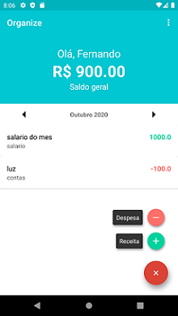

# Projeto CLONE do APP Organize

<h1>
  
  
  
  
</h1>

# Sobre o APP
O app Organizze é um aplicativo com a finalidade de controlar o saldo financeiro dos usuários, onde possibilita o cadastro de receitas e despesas por data, fazendo assim o controle do saldo disponível.  

# Sobre o Projeto
Projeto desenvolvido na linguagem Java com banco de dados Firebase, com a finalidade de aplicar na prática os conceitos das linguagens. 

