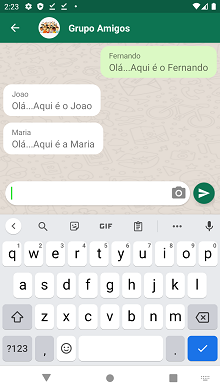
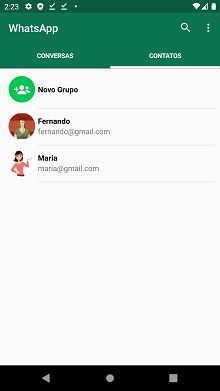
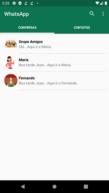

# Projeto CLONE do APP WhatsApp

<h1>
  
  
  
  
</h1>

# Sobre o APP
WhatsApp, conhecido aplicativo de troca de mensagens.  

# Sobre o Projeto
Projeto desenvolvido na linguagem Java com banco de dados Firebase, com a finalidade de aplicar na prática os conceitos das linguagens. 
Projeto engloba envio de mensagens de texto e imagens, em conversas privadas ou em grupos.
Os dados ficam aramazenados todos no Firebase.